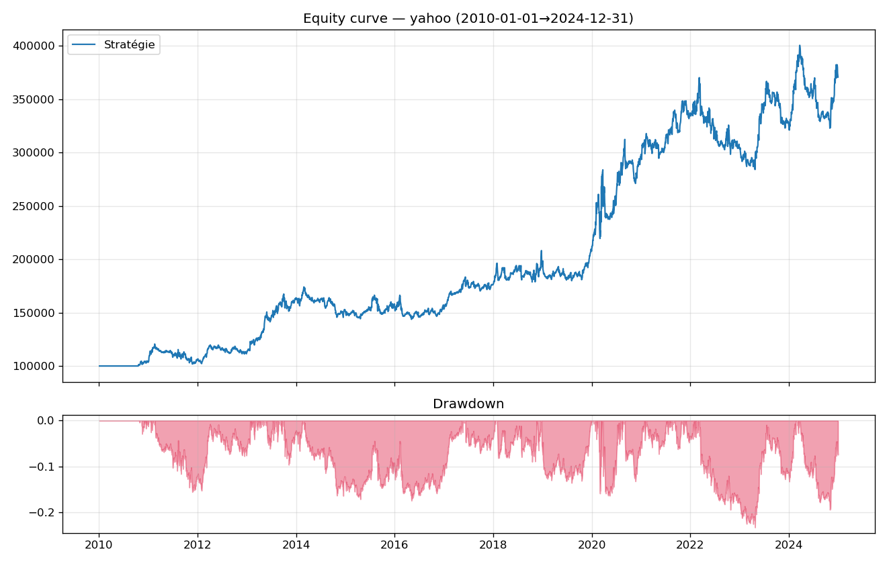

# Systematic Breakout: Backtest and Daily Screener

An event-driven portfolio backtest of a trend-filtered channel breakout, long and short, with
realistic costs and risk-based position sizing — and a daily screener that **imports the
backtest's own rule engine**, so what it flags tonight is exactly what was tested.

The point of the project is not the strategy, which is deliberately classic. It is the
discipline around it: no look-ahead, costs and gap risk paid, an in-sample / out-of-sample
split, and a control on synthetic data that the strategy is supposed to fail.

---

## Results

US large caps, 20 names, 2010–2024. \$100k initial capital, 1% of equity risked per position,
1 bp commission and 5 bp slippage on entry and exit.

| | Strategy |
|---|---:|
| Total return | +270.8% |
| CAGR | 9.15% |
| Annualised volatility | 15.34% |
| **Sharpe** | **0.65** |
| Sortino | 0.84 |
| Max drawdown | −23.3% |
| Calmar | 0.39 |



### Trade profile

| | |
|---|---:|
| Trades | 600 |
| Win rate | 38.5% |
| Expectancy per trade | +0.23 R |
| Average win | +1.72 R |
| Average loss | −0.70 R |
| Profit factor | 1.41 |
| Average holding period | 48 days |
| Share of long trades | 61.5% |

This is the signature of trend following, and it is worth reading carefully: **the strategy is
wrong 61.5% of the time and still makes money**, because winners run to +1.72 R while losers are
cut at −0.70 R. Any change that raises the win rate by cutting winners earlier would destroy it.

### In-sample versus out-of-sample

Parameters were fixed on 2010–2019 and never revisited. 2020–2024 was left untouched.

| | 2010–2019 (IS) | 2020–2024 (OOS) |
|---|---:|---:|
| CAGR | 7.63% | 11.85% |
| Sharpe | 0.64 | 0.67 |
| Max drawdown | −17.4% | −23.3% |

The out-of-sample Sharpe holds. That is the result the whole structure exists to make credible —
an OOS Sharpe that collapses relative to in-sample is the standard signature of overfitting, and
it is not what happens here.

### The control that matters most

The same strategy, unchanged, run on synthetic geometric Brownian motion — data with drift but no
exploitable trend structure:

| | Real data | Synthetic GBM |
|---|---:|---:|
| CAGR | +9.15% | **−6.08%** |
| Sharpe | +0.65 | **−0.90** |
| Profit factor | 1.41 | 0.64 |
| Expectancy | +0.23 R | −0.13 R |

On data with nothing to find, the strategy bleeds: it pays its costs and gets whipsawed buying
breakouts that mean-revert. This is the check I would want to see on someone else's backtest.
A system that makes money on random data is measuring its own engine, not the market.

---

## Method

**No look-ahead.** A signal computed at the close of day *t* is executed at the **open of day
*t+1***. Breakout levels use `.shift(1)`, so the level being broken never includes the bar doing
the breaking.

**Entry.** Long when the close exceeds the highest high of the previous 55 days *and* sits above
its 200-day moving average. Short is the mirror. The trend filter is what stops the system from
buying every bounce in a downtrend.

**Stop and exit.** Initial stop at 3 × ATR(20) from entry. Exit on a 20-day Donchian trailing
stop, so winners are left alone while the trend holds.

**Position sizing.** Each position risks 1% of current equity. Size follows from the distance to
the stop, which means a volatile name automatically gets a smaller position at identical risk.
One unit of risk is one **R**, and every trade is recorded in R so results are comparable across
names and price levels.

**Costs and frictions.** Commission and slippage on both legs. If a price gaps through the stop
overnight, the fill is at the **open**, not at the stop level.

**Portfolio constraints.** Maximum 10 concurrent positions, 20% maximum weight per name, gross
exposure capped at 1.0 (no leverage).

## The screener shares the backtest's rules

`screener.py` does not define its own logic. It imports `compute_signals` from `strategy.py` and
`CONFIG` from `config.py` — the same functions and the same parameters the backtest uses. What
the screener flags tonight is therefore exactly what the backtest measured over fifteen years.

This is the opposite of the usual arrangement, where the screener lives in a charting platform
and the backtest lives in a spreadsheet. Those two drift apart, and you end up trading something
you never validated without ever noticing.

Two screens:

1. **Signals** — what broke out today. Rare by construction: on a 20-name universe most evenings
   are empty, and a screener that speaks every night has rules that are too loose.
2. **Watchlist** — what is approaching its trigger level, ranked by distance. This is the screen
   you actually look at daily.

Each row carries its entry level, its stop, and the position size the risk rule imposes. Nothing
is left to judgement in the moment.

---

## Limitations

Stated because they bound what the numbers mean.

- **Survivorship bias.** The universe is today's index constituents, so companies that failed or
  delisted are missing. This inflates results. A point-in-time universe (CRSP, Compustat) would
  be the fix, and it is the single largest caveat here.
- **No benchmark comparison in these results.** Over 2010–2024, a period exceptionally kind to US
  equity beta, a long/short trend system is not expected to beat buy-and-hold on return. The case
  for it rests on drawdown behaviour and correlation, neither of which is quantified here yet.
- **No short borrow costs**, no dividends on short positions.
- **Constant slippage** at 5 bp, rather than a model that scales with liquidity and order size.
- **No capacity or market-impact constraint.**
- **One parameter set, no walk-forward re-optimisation** and no sensitivity study on the lookback
  or ATR multiple. The IS/OOS split is a check, not a substitute for that.

---

## Running it

```bash
pip install -r requirements.txt

python run.py --source synthetic        # smoke test, no network needed
python run.py --source yahoo --plot     # real data, cached in data_cache/
python run.py --source yahoo --start 2015-01-01 --end 2024-12-31

python screener.py --universe srd_france --near 8
python screener.py --capital 50000
```

Results are written to `outputs/`, prefixed by source so a synthetic smoke test can never
overwrite a real run.

## Layout

```
config.py      every parameter, in one place
strategy.py    the rules: entries, stops, exit levels
engine.py      event-driven portfolio engine, long/short accounting
metrics.py     Sharpe, Sortino, drawdown, Calmar, expectancy in R
run.py         orchestration, reporting, IS/OOS split
screener.py    the daily screen, importing strategy.py and config.py
outputs/       equity curve and trade log from the real run
```

Cached price data is not committed: `.gitignore` blocks `data_cache/`, and the loader
re-downloads on first run.

---

*Not investment advice. A research exercise, not a recommendation.*
